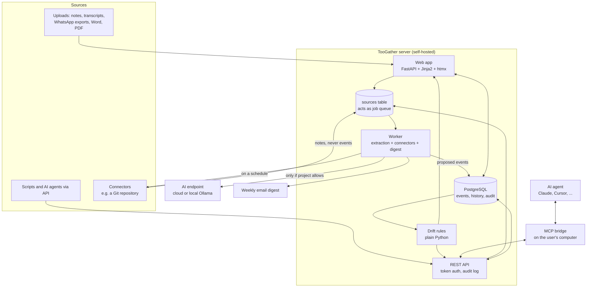
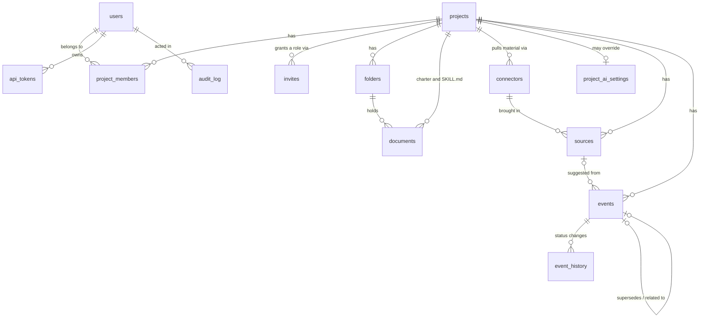
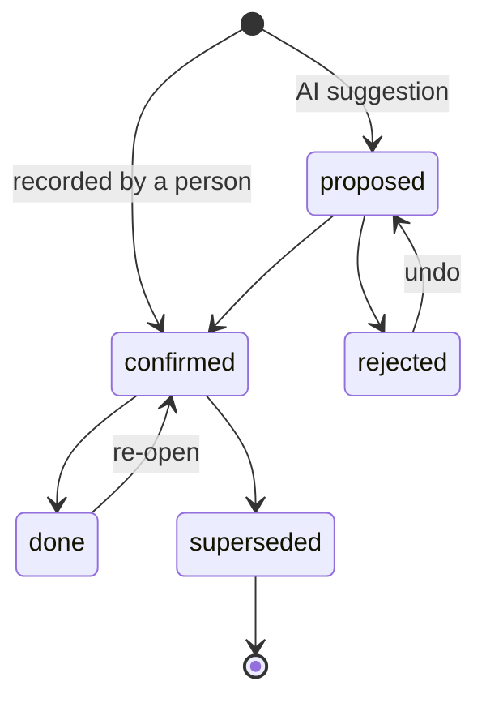

# Architecture

This document explains how TooGather is built and, more importantly, why. Read it before making structural changes.

## Overview

## Components

| Component | Code | Responsibility |
|---|---|---|
| Web app | `toogather/web/app.py`, `templates/` | Joining, projects, folders, documents, team, uploads, review, settings |
| REST API | `toogather/web/app.py` (section 9) | Token-authenticated access for the MCP bridge and scripts |
| Workspace setup | `toogather/workspace.py` | Seeds a new project's folders, charter and `SKILL.md`; slugs and invite codes |
| Project types | `toogather/project_types.py` | Which folders, charter prompts and `SKILL.md` a project type starts with |
| Importers | `toogather/importers/` | Turns an uploaded file into text: WhatsApp exports, Word, PDF |
| Connectors | `toogather/connectors/` | The connector interface, the registry, and the Git connector |
| Stored secrets | `toogather/crypto.py` | Encrypts per-project AI keys and connector tokens |
| Markdown | `toogather/web/markdown.py` | Renders document Markdown with raw HTML disabled |
| Worker | `toogather/worker.py` | Processes sources, runs due connectors, sends digests |
| Extraction | `toogather/extraction.py` | Prompting, chunking, and validating AI output |
| Drift rules | `toogather/drift.py` | Pure functions that find forgotten items |
| Data access | `toogather/repo.py`, `toogather/db.py` | All SQL, connection pool, migrations |
| Vocabulary | `toogather/models.py` | Event types, statuses, roles, allowed transitions |
| MCP bridge | `toogather/mcp_server.py` | Exposes the API as MCP tools over stdio |

## Identity and access

There are no passwords. A visitor types a display name once; that creates a
`users` row with `email` and `password_hash` NULL, and a signed session cookie
carries the user id from then on. Everything else about access is unchanged:

- `project_members` maps a user to a project with one of `owner`, `member`, `viewer`.
- Every project route calls `load_project(...)` with the minimum role it needs.
- No access at all returns **404**, not 403, so a project's existence is not revealed.
- Access at too low a role returns **403** with a message naming the role required.
- An invite link is a row in `invites` holding a project, a role, and a random code.
  Opening it inserts the membership; an existing member keeps their current role.

The trade-off is explicit: anyone who can reach the server can claim any name.
This is a tool for a team on a trusted network, not a public service. Put real
authentication in front of it before exposing it to the internet.

## Data model

The central idea: **everything the team knows is an event with one of five types** (decision, commitment, change, risk, question). A small fixed vocabulary is what makes drift detection possible. Free-form notes cannot be checked for "overdue" or "unlinked"; typed events with owners, dates, and links can.

Event lifecycle:

Allowed transitions are defined once in `models.ALLOWED_STATUS_CHANGES` and every change is written to `event_history`.

## Key decisions

### One shared server, not a copy per laptop

Separate local copies drift apart, which is the exact problem TooGather exists to solve. One server gives one source of truth, one place for drift rules to run, and one audit trail. Teams reach it over the office network or a private VPN.

### The AI only proposes

AI extraction is useful and unreliable. Automatically saving AI output would fill the store with half-wrong "facts", and people stop trusting a memory that is sometimes wrong. So every AI suggestion starts as `proposed`, and only a person can make it `confirmed`.

Document text is treated as untrusted input. The prompt tells the model to treat it as data, and output is validated item by item against `ProposedEvent`. The worst a malicious document can do is create wrong proposals that a reviewer rejects.

### AI extraction is off by default, per project

Consulting and agency work often involves client confidentiality terms. Sending documents to an AI provider should be a deliberate choice by the project owner, not a server-wide default.

### A connector brings in material, never memory

A connector writes `sources` rows and nothing else. It cannot create an event,
let alone a confirmed one. This is the same rule as "the AI only proposes",
applied to the other direction: a connector that could write confirmed events
would be a way to put unreviewed claims into a team's memory, and a memory that
is sometimes wrong stops being used.

It also keeps the system small. Because a connector's output is an ordinary
source, everything downstream already works: extraction, review, search, the
audit trail, the weekly digest. A new connector adds one class and no new path
through the system.

Three consequences are worth knowing:

- **The cursor is the connector's own business.** It is opaque text that only
  the connector that wrote it understands - for Git, the last commit imported.
  A failed run does not move it, so the next run retries the same range rather
  than stepping over it.
- **De-duplication is the database's job.** `sources` has a partial unique index
  on `(connector_id, external_id)`, so re-importing the same material is refused
  by PostgreSQL rather than prevented by careful code.
- **Runs happen in the worker, never in a request.** A web request must not wait
  on a network fetch of unknown length, so "Check now" only marks a connector
  due; the worker picks it up within about half a minute.

### A project type, not a fixed set of folders

"Code Context" means nothing on a building site. A project is created from a
type (`project_types.py`), and the type supplies its folders, the prompts in the
charter, and what `SKILL.md` tells an agent. The `SKILL.md` "where to look"
table is generated from the folders that will actually exist, so an agent is
never sent to a drawer the project does not have.

Both `projects.template_kind` and `folders.kind` are free text with no `CHECK`
constraint. Adding a project type is therefore a change to one Python file and
needs no migration - which is the point, because a migration per project type
would mean nobody adds one. An unknown kind falls back to the default rather
than raising, so a project created by a newer version still opens.

### Secrets are encrypted with a key derived from `SECRET_KEY`

Per-project AI keys and connector tokens are encrypted before they are stored.
The key comes from `SECRET_KEY` via HKDF with a fixed label, rather than from a
second setting, because asking an operator to manage two long-lived secrets is
how installs end up with `ENCRYPTION_KEY=change-me`. The label means the derived
key is unrelated to the session-signing use of the same secret.

What this protects and what it does not is stated in `crypto.py`: it protects a
database dump, a stolen backup, or a read-only SQL user; it does not protect
against anyone who can read the server's environment. If `SECRET_KEY` changes,
`decrypt_secret` returns `None` rather than raising, and the app treats that as
"no key set" and asks for it again - recoverable, instead of every page that
touches a key failing.

### Drift detection is plain code

Rules like "commitment past its due date" do not need AI. Plain rules are predictable, explainable, testable, and free to run.

### PostgreSQL does almost everything

The database is also the job queue (`FOR UPDATE SKIP LOCKED`), the full-text search engine (a generated `tsvector` column with the language-neutral `simple` configuration, which suits Indonesian, English, and mixed text), and the audit store. Every additional service is something a self-hoster has to install, secure, and monitor.

### Plain SQL instead of an ORM

The queries are simple. Plain SQL in one file (`repo.py`) is easy to read, easy to test in `psql`, and easy to review for security. All queries are parameterised.

### Server-rendered HTML with htmx

The interface is forms, lists, and buttons. Server-rendered templates with htmx avoid a second language, a JavaScript build step, and a separate frontend deployment. htmx is bundled locally so the app works on offline office networks, and a strict Content-Security-Policy allows scripts only from the app itself.

### OpenAI-compatible HTTP instead of provider SDKs

One short HTTP call works with OpenAI, Anthropic's compatible endpoint, OpenRouter, and Ollama. It keeps dependencies small and makes it obvious exactly what data is sent.

### MCP through a bridge, not direct access

The MCP bridge runs on the user's computer and calls the REST API with that user's token. Agents therefore get exactly the user's permissions, every call is audited, and revoking a token cuts access instantly. Agents cannot write confirmed memory; `submit_note` goes through human review like any upload.

## Request flow: uploading meeting notes

1. A member uploads a file. The web app stores it in `sources` with status `pending`.
2. The worker claims it with `UPDATE ... FOR UPDATE SKIP LOCKED` (safe with several workers).
3. If the project has AI extraction off, or no endpoint is configured, the source is marked `skipped` with a readable reason.
4. Otherwise the text is split into chunks, each chunk is sent to the AI endpoint, and the output is validated.
5. Valid items are saved as `proposed` events linked to the source.
6. A member confirms or rejects them in Review. Drift rules then include the confirmed events.

## Request flow: a connector run

1. The worker asks for the most overdue connector with
   `UPDATE ... FOR UPDATE SKIP LOCKED`, which marks it `running` so a second
   worker cannot pick up the same one.
2. It decrypts that connector's secret and calls `fetch()` with a `Context`.
3. The Git connector fetches into its bare mirror, lists commits after its
   cursor, and returns one item summarising the batch.
4. Each item is inserted as a `sources` row of kind `connector`. The unique
   index on `(connector_id, external_id)` quietly refuses anything already here.
5. The cursor and the run's outcome are saved. A failure leaves the cursor
   alone, so the same range is tried again next time.
6. From here it is the upload flow: the source is `pending`, and the worker's
   next pass extracts proposals from it if the project allows that.

Uploads are processed before connectors, because somebody is waiting for an
upload they just made and nobody is watching a repository poll.

## Extending TooGather

- **New drift rule:** add a pure function to `drift.py`, append it to `RULES`, and add tests in `tests/test_drift.py`.
- **New API endpoint:** add it to section 9 of `web/app.py`. Authenticate with `api_user()`, check access with `load_project()`, and write an `audit()` entry.
- **New connector:** subclass `Connector` in `toogather/connectors/`, implement `fetch`, and register it in that package's `__init__.py`. The rules a connector must follow are in the `base.py` docstring. No migration is needed: `connectors.kind` is free text.
- **New upload format:** add a reader under `toogather/importers/` and a branch in `read_file`. The web app asks that module which formats exist, so nothing else changes.
- **New project type:** add a `ProjectType` to `toogather/project_types.py` and put it in `ALL_TYPES`. No migration is needed.
- **Schema change:** add a new file such as `toogather/migrations/004_add_x.sql`. Never edit a migration that has already been released.
- **New event type:** change `EventType` in `models.py`, add a migration updating the `CHECK` constraint, and add a color in `app.css`. Discuss in an issue first; the small vocabulary is deliberate.
