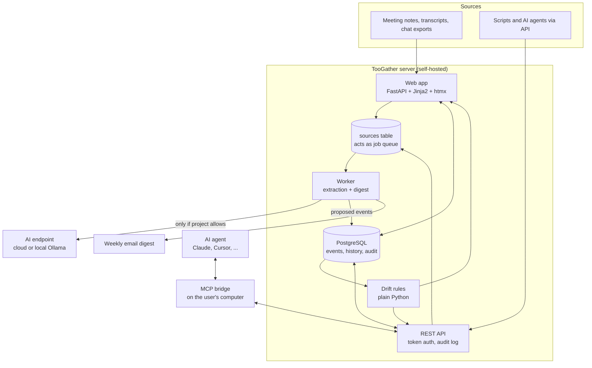
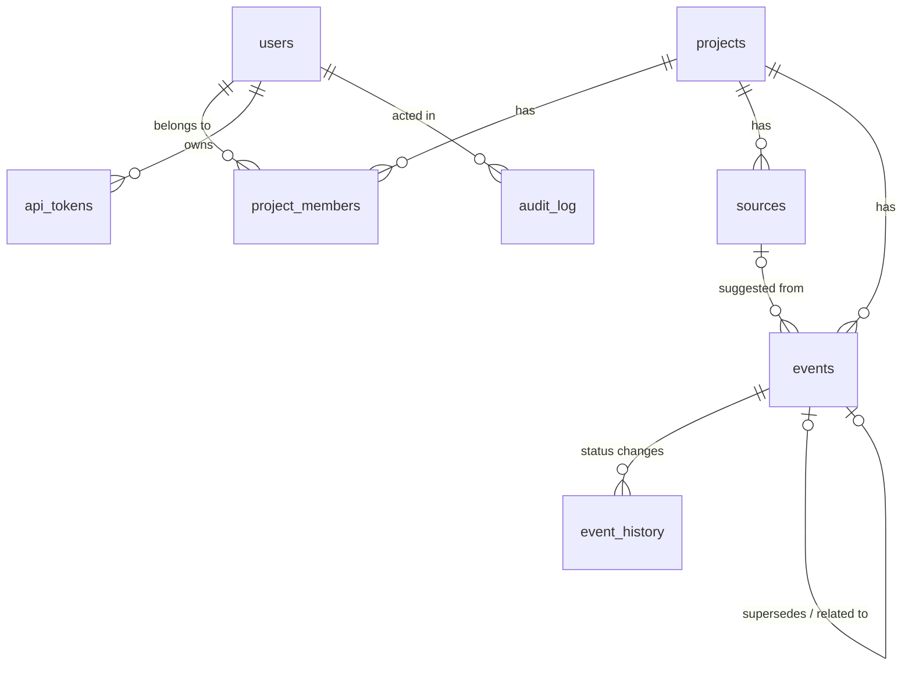
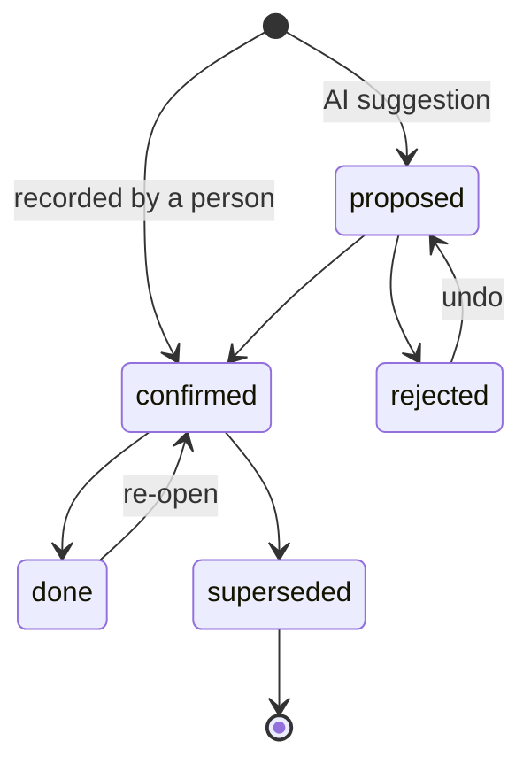

# Architecture

This document explains how TooGather is built and, more importantly, why. Read it before making structural changes.

## Overview

## Components

| Component | Code | Responsibility |
|---|---|---|
| Web app | `toogather/web/app.py`, `templates/` | Sign-in, projects, uploads, review, search, settings |
| REST API | `toogather/web/app.py` (section 7) | Token-authenticated access for the MCP bridge and scripts |
| Worker | `toogather/worker.py` | Processes uploads, calls the AI endpoint, sends digests |
| Extraction | `toogather/extraction.py` | Prompting, chunking, and validating AI output |
| Drift rules | `toogather/drift.py` | Pure functions that find forgotten items |
| Data access | `toogather/repo.py`, `toogather/db.py` | All SQL, connection pool, migrations |
| Vocabulary | `toogather/models.py` | Event types, statuses, roles, allowed transitions |
| MCP bridge | `toogather/mcp_server.py` | Exposes the API as MCP tools over stdio |

## Data model

The central idea: **everything the team knows is an event with one of five types** (decision, commitment, change, risk, question). A small fixed vocabulary is what makes drift detection possible. Free-form notes cannot be checked for "overdue" or "unlinked"; typed events with owners, dates, and links can.

Event lifecycle:

Allowed transitions are defined once in `models.ALLOWED_STATUS_CHANGES` and every change is written to `event_history`.

## Key decisions

### One shared server, not a copy per laptop

Separate local copies drift apart, which is the exact problem TooGather exists to solve. One server gives one source of truth, one place for drift rules to run, and one audit trail. Teams reach it over the office network or a private VPN.

### The AI only proposes

AI extraction is useful and unreliable. Automatically saving AI output would fill the store with half-wrong "facts", and people stop trusting a memory that is sometimes wrong. So every AI suggestion starts as `proposed`, and only a person can make it `confirmed`.

Document text is treated as untrusted input. The prompt tells the model to treat it as data, and output is validated item by item against `ProposedEvent`. The worst a malicious document can do is create wrong proposals that a reviewer rejects.

### AI extraction is off by default, per project

Consulting and agency work often involves client confidentiality terms. Sending documents to an AI provider should be a deliberate choice by the project owner, not a server-wide default.

### Drift detection is plain code

Rules like "commitment past its due date" do not need AI. Plain rules are predictable, explainable, testable, and free to run.

### PostgreSQL does almost everything

The database is also the job queue (`FOR UPDATE SKIP LOCKED`), the full-text search engine (a generated `tsvector` column with the language-neutral `simple` configuration, which suits Indonesian, English, and mixed text), and the audit store. Every additional service is something a self-hoster has to install, secure, and monitor.

### Plain SQL instead of an ORM

The queries are simple. Plain SQL in one file (`repo.py`) is easy to read, easy to test in `psql`, and easy to review for security. All queries are parameterised.

### Server-rendered HTML with htmx

The interface is forms, lists, and buttons. Server-rendered templates with htmx avoid a second language, a JavaScript build step, and a separate frontend deployment. htmx is bundled locally so the app works on offline office networks, and a strict Content-Security-Policy allows scripts only from the app itself.

### OpenAI-compatible HTTP instead of provider SDKs

One short HTTP call works with OpenAI, Anthropic's compatible endpoint, OpenRouter, and Ollama. It keeps dependencies small and makes it obvious exactly what data is sent.

### MCP through a bridge, not direct access

The MCP bridge runs on the user's computer and calls the REST API with that user's token. Agents therefore get exactly the user's permissions, every call is audited, and revoking a token cuts access instantly. Agents cannot write confirmed memory; `submit_note` goes through human review like any upload.

## Request flow: uploading meeting notes

1. A member uploads a file. The web app stores it in `sources` with status `pending`.
2. The worker claims it with `UPDATE ... FOR UPDATE SKIP LOCKED` (safe with several workers).
3. If the project has AI extraction off, or no endpoint is configured, the source is marked `skipped` with a readable reason.
4. Otherwise the text is split into chunks, each chunk is sent to the AI endpoint, and the output is validated.
5. Valid items are saved as `proposed` events linked to the source.
6. A member confirms or rejects them in Review. Drift rules then include the confirmed events.

## Extending TooGather

- **New drift rule:** add a pure function to `drift.py`, append it to `RULES`, and add tests in `tests/test_drift.py`.
- **New API endpoint:** add it to section 7 of `web/app.py`. Authenticate with `api_user()`, check access with `load_project()`, and write an `audit()` entry.
- **Schema change:** add a new file such as `toogather/migrations/002_add_x.sql`. Never edit a migration that has already been released.
- **New event type:** change `EventType` in `models.py`, add a migration updating the `CHECK` constraint, and add a color in `app.css`. Discuss in an issue first; the small vocabulary is deliberate.
